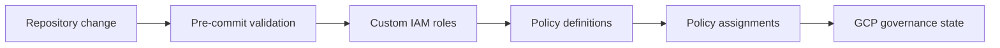

# Architecture

<!-- markdownlint-disable MD013 -->

## 1. Purpose

`eng-gcp-governance` defines GCP organization custom IAM roles, organization policy constraints, and policy assignments as Terraform configuration. Its purpose is to apply governance guardrails to GCP folders and projects through ordered policy layers.

## 2. System overview

The repository is a single-purpose GCP governance policy-as-code repository.
Three numbered Terraform roots separate role definitions, policy definitions,
and assignments. Assignment modules hold target-specific policy resources.
Each root has a GCS backend prefix and a wrapper script. GitHub Actions runs
the repository's pre-commit checks.

The arrows describe the documented apply and validation order; they do not prove
a runtime service call or a direct Terraform dependency between roots.

## 3. Current vs intended architecture

| Area | Current architecture | Intended architecture | Status | Evidence |
| --- | --- | --- | --- | --- |
| Governance layers | Roles, definitions, and assignments live in separate numbered Terraform roots. | Apply the layers in folder-number order. | Documented | [CONTRIBUTING.md](../CONTRIBUTING.md), [src/](../src/) |
| Assignment targets | Assignment root delegates to modules for `custom`, `dev`, `pagopa`, `prod`, and `uat`. | Add target-specific assignments through the existing module structure. | Evidenced | [src/03_policy_assignments/00_main.tf](../src/03_policy_assignments/00_main.tf), [src/03_policy_assignments/01_pagopa.tf](../src/03_policy_assignments/01_pagopa.tf) |
| Validation | Pre-commit runs Terraform formatting, documentation, validation, linting, and security hooks. | Run repository-local validation before review; `terraform_docs` may refresh generated README blocks. | Documented | [.pre-commit-config.yaml](../.pre-commit-config.yaml), [.github/workflows/_pre-commit.yml](../.github/workflows/_pre-commit.yml) |

## 4. Technology stack

| Area | Technology | Status | Evidence |
| --- | --- | --- | --- |
| Infrastructure definition | Terraform `>= 1.7.0` | Evidenced | [src/01_custom_roles/00_main.tf](../src/01_custom_roles/00_main.tf) |
| GCP provider | `hashicorp/google` `6.28.0` | Evidenced | [src/03_policy_assignments/modules/pagopa/00_main.tf](../src/03_policy_assignments/modules/pagopa/00_main.tf) |
| State | Google Cloud Storage backend | Evidenced | [src/01_custom_roles/00_backend.tfvars](../src/01_custom_roles/00_backend.tfvars) |
| Validation | pre-commit Terraform hooks and GitHub Actions | Evidenced | [.pre-commit-config.yaml](../.pre-commit-config.yaml), [.github/workflows/_pre-commit.yml](../.github/workflows/_pre-commit.yml) |

## 5. Repository map

| Path | Responsibility | Notes |
| --- | --- | --- |
| [src/01_custom_roles/](../src/01_custom_roles/) | Organization-level custom IAM role definitions | Uses the `custom_roles` state prefix and a Terraform wrapper. |
| [src/02_policy_custom/](../src/02_policy_custom/) | Custom organization policy constraint source | The public-bucket constraint is currently stored as `.tf.txt`; activation status is unknown. |
| [src/03_policy_assignments/](../src/03_policy_assignments/) | Assignment root for target modules | Uses the `policy_assignments` state prefix and exposes outputs. |
| [src/03_policy_assignments/modules/](../src/03_policy_assignments/modules/) | Target-specific policy assignment modules | Contains `custom`, `dev`, `pagopa`, `prod`, and `uat`. |
| [.github/workflows/_pre-commit.yml](../.github/workflows/_pre-commit.yml) | CI validation entrypoint | Runs pre-commit in a pinned container image. |
| [.github/workflows/_pr-title.yml](../.github/workflows/_pr-title.yml) | Pull request title validation | Workflow details are not further documented by current repository docs. |
| [CONTEXT.md](../CONTEXT.md) | GCP governance vocabulary | Defines repository-specific governance terms. |
| [docs/domain/gcp-governance/RULES.md](domain/gcp-governance/RULES.md) | Normative governance rules | Records enforcement owners and remediation. |
| [docs/adr/](adr/) | Repository-wide decisions | Contains the proposed knowledge-layout decision and local ADR contract. |

## 6. Architectural boundaries

- **Roles to definitions:** Custom roles precede policy definitions in the documented apply order. Status: Documented. Evidence: [CONTRIBUTING.md](../CONTRIBUTING.md).
- **Definitions to assignments:** Policy definitions precede policy assignments in the documented apply order. Status: Documented. Evidence: [CONTRIBUTING.md](../CONTRIBUTING.md).
- **Assignment root to modules:** The root consumes local modules through explicit `source` paths. Status: Evidenced. Evidence: [src/03_policy_assignments/01_pagopa.tf](../src/03_policy_assignments/01_pagopa.tf), [src/03_policy_assignments/03_custom.tf](../src/03_policy_assignments/03_custom.tf).
- **Repository to GCP:** Terraform wrappers initialize GCS state and invoke Terraform against GCP. Status: Evidenced for intended side effect, but live execution was not performed. Evidence: [src/01_custom_roles/terraform.sh](../src/01_custom_roles/terraform.sh), [src/01_custom_roles/00_backend.tfvars](../src/01_custom_roles/00_backend.tfvars).

## 7. Dependency rules

### Allowed direction

- Role definitions are upstream of policy definitions and assignments in the documented apply order.
- The assignment root may consume local assignment modules through their `source` paths.
- Repository configuration is upstream of GCP governance state only when a wrapper executes Terraform.
- Validation may inspect the repository and Terraform configuration before a reviewed change is applied.

### Avoid / forbidden

- Do not hardcode credentials, tokens, keys, or Terraform state in the repository.
- Do not rely on implicit policy inheritance; set `inherit_from_parent` explicitly for policy specifications.
- Do not treat the pre-commit workflow as proof that a live GCP plan or apply succeeded.

## 8. Key flows

### Build/test flow

1. A contributor changes Terraform or supporting configuration.
2. Pre-commit formats Terraform, generates Terraform docs, validates configurations without remote backends, runs TFLint, and performs configured security checks.
3. The pull request workflow runs the same pre-commit configuration in a pinned container.

Evidence: [.pre-commit-config.yaml](../.pre-commit-config.yaml), [.github/workflows/_pre-commit.yml](../.github/workflows/_pre-commit.yml).

### Deployment/operations flow

1. A contributor enters one numbered Terraform root.
2. `terraform.sh` sets the configured GCP project, initializes the GCS backend, and invokes an allowed Terraform action.
3. Terraform reads the root and its local modules and can change GCP governance state.

Evidence: [src/01_custom_roles/terraform.sh](../src/01_custom_roles/terraform.sh), [src/02_policy_custom/terraform.sh](../src/02_policy_custom/terraform.sh), [src/03_policy_assignments/terraform.sh](../src/03_policy_assignments/terraform.sh).

## 9. Configuration and environment

- Terraform versions are constrained by each root's `required_version` and `.terraform-version`. Evidence: [src/01_custom_roles/00_main.tf](../src/01_custom_roles/00_main.tf), [.terraform-version](../.terraform-version).
- Root backend configuration is stored in `00_backend.tfvars` files and uses the `tfapporg-terraform-state` bucket with a root-specific prefix. Evidence: [src/01_custom_roles/00_backend.tfvars](../src/01_custom_roles/00_backend.tfvars), [src/02_policy_custom/00_backend.tfvars](../src/02_policy_custom/00_backend.tfvars), [src/03_policy_assignments/00_backend.tfvars](../src/03_policy_assignments/00_backend.tfvars).
- Root variables provide GCP project, organization, folder, region, and zone values. Evidence: [src/03_policy_assignments/99_variables.tf](../src/03_policy_assignments/99_variables.tf).
- The wrappers call `gcloud config set project` and require local GCP authentication for mutating actions. Evidence: [src/01_custom_roles/terraform.sh](../src/01_custom_roles/terraform.sh), [CONTRIBUTING.md](../CONTRIBUTING.md).

## 10. Testing and validation

| Change type | Suggested validation | Evidence |
| --- | --- | --- |
| Terraform formatting | Run the configured `terraform_fmt` hook. | [.pre-commit-config.yaml](../.pre-commit-config.yaml) |
| Terraform documentation | Run the configured `terraform_docs` hook and inspect generated blocks. | [.pre-commit-config.yaml](../.pre-commit-config.yaml), [src/03_policy_assignments/README.md](../src/03_policy_assignments/README.md) |
| Terraform configuration | Run `terraform_validate` with backend disabled and the lockfile read-only. | [.pre-commit-config.yaml](../.pre-commit-config.yaml) |
| Policy or role change | Review a scoped Terraform plan, test policy changes in development, and obtain security review before weakening enforcement. | [CONTRIBUTING.md](../CONTRIBUTING.md), [SECURITY.md](../SECURITY.md) |
| Documentation change | Run Markdown/link checks available in the local environment and inspect changed links. | [.github/instructions/internal-markdown.instructions.md](../.github/instructions/internal-markdown.instructions.md) |

No repository-root test suite or Makefile was found in the target repository. Live `plan`, `apply`, and remote-backend checks are intentionally excluded from this documentation bootstrap.

## 11. Architectural decisions visible in the repo

- **Decision:** Apply custom roles, policy definitions, and assignments in folder-number order. **Status:** Documented. **Evidence:** [CONTRIBUTING.md](../CONTRIBUTING.md). **Trade-off:** not recorded. **Related ADR:** not recorded.
- **Decision:** Store Terraform state in GCS with a distinct prefix per root. **Status:** Evidenced. **Evidence:** [src/01_custom_roles/00_backend.tfvars](../src/01_custom_roles/00_backend.tfvars), [src/02_policy_custom/00_backend.tfvars](../src/02_policy_custom/00_backend.tfvars), [src/03_policy_assignments/00_backend.tfvars](../src/03_policy_assignments/00_backend.tfvars). **Trade-off:** not recorded. **Related ADR:** not recorded.
- **Decision:** Use one GCP governance knowledge context as a deliberate bounded exception. **Status:** Accepted. **Evidence:** [0001-gcp-governance-single-context.md](adr/0001-gcp-governance-single-context.md); custom roles, custom policy definitions, and policy assignments have distinct representation, state, delivery, independent execution, and directional-order signals. **Trade-off:** Shared vocabulary stays centralized while richer domain evidence remains visible in this architecture contract. **Related ADR:** [0001-gcp-governance-single-context.md](adr/0001-gcp-governance-single-context.md).

## 12. AI-agent working rules

Agents must read this document before making structural changes. Preserve existing patterns and boundaries, keep changes scoped to the requested layer, and update this document when an intentional architectural change occurs. Report conflicts between repository evidence and instructions before editing. Prefer existing repository patterns over new abstractions. Do not introduce new frameworks or cross-cutting refactors without explicit approval.

## 13. Last verified

- Verification date: 2026-09-01.
- Agent or tool: GitHub Copilot using repository file inspection.
- Files inspected: root instructions and README, `CONTRIBUTING.md`, `SECURITY.md`, `.gitignore`, `.pre-commit-config.yaml`, Terraform roots and wrappers, assignment modules, and GitHub workflows.
- Commands considered: Markdown/link validation, pre-commit validation, and non-mutating Terraform validation. No live Terraform command was run.
- Confidence: High for repository structure and documented workflows; medium for live GCP behavior because no remote execution was performed.

## 14. Unknown / To verify

- A future richer multi-context migration remains unperformed. Custom roles,
  policy definitions, and policy assignments have distinct representations,
  backend prefixes, and a directional apply order; the accepted single-context
  layout is an explicit exception for this wave.
- Why the numbered Terraform roots and backend prefixes were separated; no accepted ADR records that rationale.
- Whether `src/02_policy_custom/02_policy_public_buckets.tf.txt` is intentionally inactive or should be converted to a Terraform source file.
- Whether `dev`, `uat`, and `prod` assignment modules are placeholders or intentionally empty in the current release.
- Whether the configured GCS backend and project identifiers are still current; this bootstrap does not contact GCP.
- Whether the workflow's Trivy description in `SECURITY.md` is backed by a current hook or workflow step; the visible pre-commit configuration does not show a Trivy hook.
- Whether the repository has a separately managed documentation validator outside the checked-in files.
